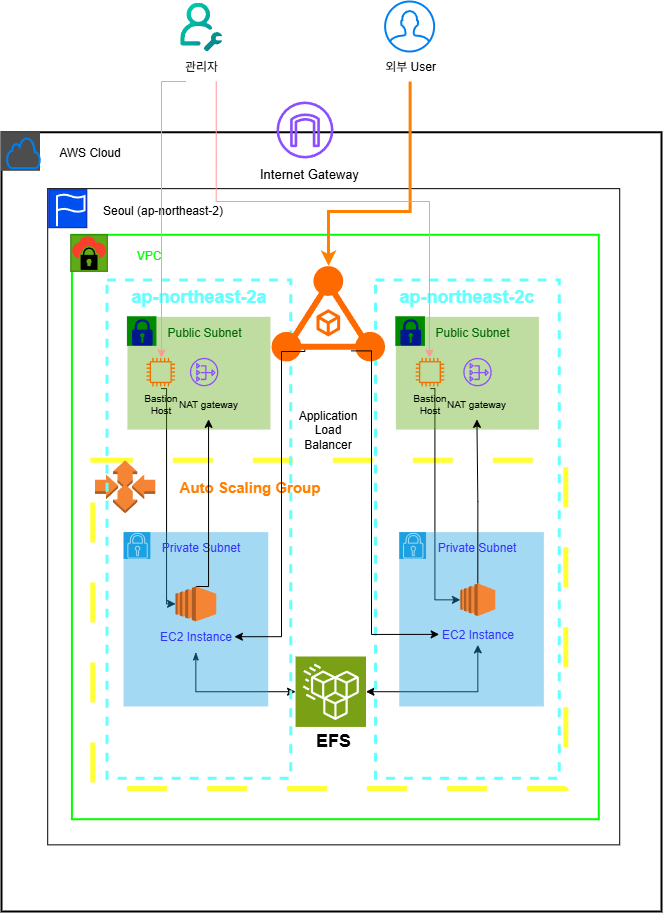

# AWS 기반 고가용성 NAS 구축 프로젝트

1. 프로젝트 개요 (Overview)
이 프로젝트는 AWS 클라우드 환경에서 보안성과 고가용성을 최우선으로 고려하여 개인용 NAS(Network Attached Storage)를 구축하는 것을 목표로 합니다.

단순한 파일 서버 구축을 넘어, 실제 서비스 환경에서 발생할 수 있는 장애에 자동으로 대응하고 데이터를 안전하게 보호하는 안정적이고 탄력적인 클라우드 인프라를 설계하고 구현하는 데 중점을 두었습니다.

2. 아키텍처 (Architecture) 🚀
이 시스템의 모든 구성 요소는 아래 아키텍처 다이어그램에 따라 배치되었습니다.

설계 핵심 원칙:
Multi-AZ 구성: 두 개의 독립된 가용 영역(AZ)에 자원을 이중으로 배치하여 한쪽 데이터 센터에 장애가 발생해도 서비스 중단이 없도록 설계했습니다.

네트워크 망 분리: Public Subnet과 Private Subnet을 분리하여, 외부에는 서비스 접근점(ALB, Bastion Host)만 노출하고 핵심 데이터와 서버는 Private Subnet에 안전하게 격리했습니다.

자동화된 관리: Auto Scaling Group을 통해 서버의 상태를 지속적으로 감시하고, 문제 발생 시 자동으로 복구하도록 구성했습니다.

3. 핵심 기능 (Key Features) ✨
이 아키텍처는 다음과 같은 핵심 기능을 제공합니다.

⚙️ 고가용성 및 자동 장애 복구 (High Availability & Automatic Failover)

Application Load Balancer(ALB)와 Auto Scaling Group(ASG)이 EC2 인스턴스의 상태를 실시간으로 확인(Health Check)합니다.

하나의 가용 영역 또는 인스턴스에 장애가 발생하면, 트래픽이 자동으로 건강한 인스턴스로 즉시 전환되어 서비스 중단을 방지합니다.

🛡️ 강화된 다계층 보안 (Enhanced Multi-Layered Security)

모든 NAS 서버(EC2)는 외부에서 직접 접근할 수 없는 Private Subnet에 위치합니다.

관리자 접근은 지정된 보안 통로인 Bastion Host를 통해서만 가능하도록 제한하여 시스템 보안을 강화했습니다.

🗂️ 중앙화된 공유 스토리지 (Centralized Shared Storage)

Amazon EFS (Elastic File System)를 도입하여 여러 EC2 인스턴스가 동일한 파일 시스템을 공유합니다.

이를 통해 어느 서버로 접속하든 항상 일관된 데이터를 읽고 쓸 수 있으며, EFS 자체도 Multi-AZ로 구성되어 데이터의 내구성이 매우 높습니다.

📈 탄력적 확장성 (Elastic Scalability)

Auto Scaling Group을 통해 향후 트래픽 증가 시 EC2 인스턴스를 자동으로 확장할 수 있는 기반을 마련했습니다.

EFS는 저장 공간 사용량에 따라 용량이 자동으로 늘어나므로 스토리지 관리가 용이합니다.

🔒 안전한 아웃바운드 통신 (Secure Outbound Communication)

NAT Gateway를 통해 Private Subnet의 EC2 인스턴스가 외부 인터넷으로 OS 업데이트 등을 안전하게 수행할 수 있도록 구성했습니다. 외부에서 내부로의 직접적인 연결은 차단됩니다.

4. 기술 스택 (Tech Stack & Key Services) 🛠️
네트워크: VPC, Subnet, Route Table, Internet Gateway, NAT Gateway

컴퓨팅: EC2, Auto Scaling Group

스토리지: EFS

로드 밸런싱: Application Load Balancer (ALB)

보안 및 접근 제어: Security Group, NACL, Bastion Host, IAM

모니터링: CloudWatch